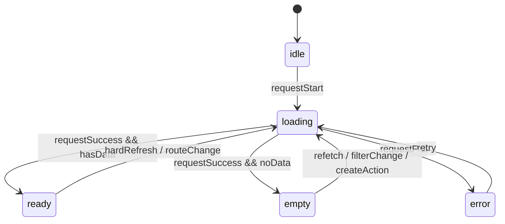

# Archived: SysFolio View State Layering Strategy

> 已归档。当前 view-state 分层请优先阅读 `../interaction-state-matrix.md` 与 `../view-density-spec.md`。

# SysFolio View State Layering Strategy

## 文档目的

这份文档重新定义 `idle / loading / ready / empty / error` 这五种状态在 6 层架构中的落位。

核心不是“每个页面都要有五态”这么简单，而是：

- 哪一层应该提供状态原件
- 哪一层应该承接五态
- 哪一层应该计算状态
- 哪一层应该决定状态是局部的还是整页阻塞的

## 结论

推荐这样理解五态：

- `primitives`
  提供状态表达原件和控件级状态
- `patterns`
  作为五态的主要承载层
- `business`
  计算状态、注入文案和恢复动作
- `component / page edge`
  决定状态影响范围和升级策略

一句话：

`primitives 提供状态原件，patterns 承载 view state，business/page 编排 view state`

## 一、为什么要提前定义这五种状态

如果不提前定义，前端实现通常会出现这些问题：

- 初始进入视图时闪一下旧内容
- loading 时布局跳动
- 没数据和报错混成同一种空白页
- pattern 局部加载和外层容器加载互相覆盖
- 后续加 skeleton、重试、渐进加载时很难整理

所以这五种状态不是“补丁逻辑”，而是视图容器的基础结构。

## 二、状态定义

### 1. `idle`

含义：

- 视图容器刚挂载
- 还没开始请求
- 或依赖条件尚未满足，暂时不能请求

典型场景：

- 路由刚切入
- 必要参数还没准备好
- 需要等待外层上下文

前端建议：

- 保持稳定外壳
- 不渲染误导性的旧数据
- 不急着显示错误或空态

视觉建议：

- 通常不做强存在感占位页
- 可以显示结构占位，也可以直接过渡到 loading

### 2. `loading`

含义：

- 当前内容区域已进入获取数据阶段
- 当前内容区域的主体暂时不可用

前端建议：

- 优先保持外层结构骨架稳定
- 使用 skeleton、loading placeholder 或局部占位
- 避免整个内容区域大幅跳动

视觉建议：

- loading 应尽量保留最终布局骨架
- 不建议只放一个孤立 spinner 让用户失去结构感

### 3. `ready`

含义：

- 当前内容区域数据可用
- 当前内容区域可正常交互

前端建议：

- 正常渲染当前内容主体
- 保留必要的局部异步状态，但当前容器主状态进入 `ready`

视觉建议：

- 主体结构完整
- 动线清晰
- 主信息和辅助信息层级稳定

### 4. `empty`

含义：

- 请求成功
- 但当前内容区域没有可展示的数据
- 这是业务结果，不是异常

前端建议：

- 单独渲染空态
- 明确告诉用户“为什么为空”和“下一步能做什么”

视觉建议：

- 空态不等于空白
- 需要有标题、解释、建议动作或返回路径

### 5. `error`

含义：

- 请求失败
- 或关键依赖损坏，当前内容区域无法正常展示

前端建议：

- 单独渲染错误态
- 提供明确错误说明、重试动作、回退路径

视觉建议：

- 错误态要可恢复
- 不建议只显示技术报错文本

## 三、推荐状态转移

推荐 pattern / business 容器主状态转移为：



补充说明：

- `ready -> loading`
  可以用于重新拉取当前区域内容
- 如果只是局部刷新，优先保持外层 `ready`，把更小范围区域设为局部 loading

## 四、按层分工

### 1. `Primitives`

primitives 不应普遍承担五态本身，但应提供五态所需的“状态原件”。

推荐提供：

- `Spinner`
- `SkeletonBlock`
- `InlineNotice`
- `Progress`
- `Tooltip`
- `RetryButton`
- 带 `loading` 态的 `Button`

primitives 主要关心的是控件级状态：

- `default`
- `hover`
- `focus-visible`
- `active`
- `disabled`
- `loading`（如适用）

关键判断：

- `Input` 的空值不是这里的 `empty`
- `Button` 的默认态也不是这里的 `ready`

### 2. `Patterns`

patterns 才是五态的主要承载层，尤其是 data-bearing patterns。

典型对象：

- `TreeNav`
- `ContentPane`
- `ReadingPane`
- `ListPane`
- `DetailPane`
- `ContextPanel`
- `LoadingState`
- `EmptyState`
- `ErrorState`

这些 pattern 应优先考虑：

- `idle`
- `loading`
- `ready`
- `empty`
- `error`

关键判断：

- 五态主要属于“承载一块内容区域”的模式
- 不是每个最小 primitive 都要变成五态组件

### 3. `Business`

business 层负责：

- 计算当前 pattern 的 view state
- 决定是 `ready / empty / error` 中的哪一种
- 提供业务文案
- 提供恢复动作

例如：

- `TocTree`
  可以是 `ready / empty / error`
- `FileTree`
  可以是 `loading / ready / empty / error`
- `DocumentContent`
  可以是 `loading / ready / empty / error`

### 4. `Component / Page Edge`

这一层负责：

- 决定状态影响范围
- 决定局部状态是否升级为整页状态
- 决定外层骨架在异常状态下是否仍然保留

关键判断：

- 不是所有五态都要升级成整页状态
- 外层容器若已 ready，局部 panel 的刷新不应把整页打回 loading

## 五、推荐容器结构

推荐把 data-bearing view 拆成两层：

1. `Container`
- 负责数据请求
- 负责状态计算
- 负责决定当前 `viewState`

2. `View / Pattern`
- 只负责根据 `viewState` 渲染对应表达

推荐结构示意：

```tsx
type ViewState = "idle" | "loading" | "ready" | "empty" | "error";

function FileTreeContainer() {
  const viewState = useFileTreeViewState();

  return <FileTreeView viewState={viewState} />;
}
```

这类拆法的好处是：

- 视图状态集中
- 逻辑更容易测试
- skeleton / empty / error 不会散落在各个分支里

## 六、哪些对象必须优先考虑五态

优先考虑的对象：

- 树形导航
- 列表面板
- 正文内容区
- 详情区
- 搜索结果区
- 上下文信息区

不必强制做成五态对象的：

- 单个按钮
- 单个输入框
- 单个 tag
- 单个 icon button

一句话：

- 五态优先属于“内容承载模式”
- 不是优先属于“最小交互控件”

## 七、状态升级规则

推荐使用这条原则：

1. 先在最小合理范围内表达状态
2. 再决定要不要升级到更高层

例如：

- `FileTree` 没数据
  先表现为 `FileTree.empty`
- `DocumentContent` 加载失败
  先表现为 `DocumentContent.error`
- 只有当外层主任务整体不可继续时
  才升级成更高层的 page / feature 级 `error`

## 八、针对当前 SysFolio 的建议

### 1. `TreeNav`

建议具备：

- `idle`
- `loading`
- `ready`
- `empty`
- `error`

### 2. `ContentPane / ReadingPane`

建议具备：

- `idle`
- `loading`
- `ready`
- `empty`
- `error`

### 3. `ContextPanel`

建议具备：

- `loading`
- `ready`
- `empty`
- `error`

但通常保持局部状态，不默认升级成整页状态。

### 4. 页面层

页面层负责决定：

- 左栏状态是否阻断主内容
- 右栏异常是否影响整页主任务
- 某个 pattern 的错误是否需要升级成整页错误

## 九、给前端的实现约束

1. 不要把五态只理解成页面级状态。
2. 不要要求每个 primitive 都实现五态。
3. 要求每个 data-bearing pattern 提前考虑五态。
4. primitive 层必须提供状态表达原件。
5. business 层负责状态计算和文案动作注入。
6. page / feature 层负责决定状态影响范围和升级策略。

## 当前判断

当前最合理的版本不是：

- “每个页面组件都有五态”

而是：

- `primitives` 提供状态原件
- `patterns` 承担五态
- `business / component` 负责编排五态

这才和当前的 6 层架构是对齐的。
