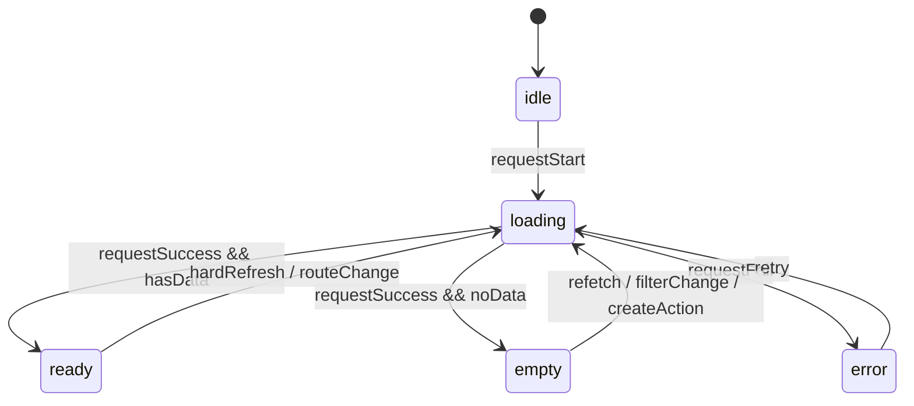

# SysFolio Page View State Strategy

## 文档目的

这份文档定义页面级组件在前端实现时应提前考虑的五种基础状态：

- `idle`
- `loading`
- `ready`
- `empty`
- `error`

这五种状态主要用于：

- 页面级视图
- 主要内容容器
- 业务级列表页、详情页、目录页、阅读页

它们不一定要求每个最小组件都完整实现，但每个页面组件或页面级业务容器都应提前建模。

## 结论

推荐把每个页面级视图都显式建成一个有限状态模型：

`idle -> loading -> ready | empty | error`

也就是说：

- 页面不是“有数据就 render，没数据就临时判断”
- 页面应先定义自己处于哪种 view state
- UI 再根据状态切换对应的页面表达

## 一、为什么要提前定义这五种状态

如果不提前定义，前端实现通常会出现这些问题：

- 初始进入页面时闪一下旧内容
- loading 时布局跳动
- 没数据和报错混成同一种空白页
- 页面局部加载和页面整体加载互相覆盖
- 后续加 skeleton、重试、渐进加载时很难整理

所以这五种状态不是“补丁逻辑”，而是页面组件的基础结构。

## 二、状态定义

### 1. `idle`

含义：

- 页面刚挂载
- 还没开始请求
- 或依赖条件尚未满足，暂时不能请求

典型场景：

- 路由刚切入
- 必要参数还没准备好
- 需要等待外层上下文

前端建议：

- 保持稳定外壳
- 不渲染误导性的旧数据
- 不急着显示错误或空态

视觉建议：

- 通常不做强存在感页面
- 可以显示结构占位，也可以直接过渡到 loading

### 2. `loading`

含义：

- 页面已进入获取数据阶段
- 主要内容暂时不可用

前端建议：

- 优先保持页面骨架稳定
- 使用 skeleton、loading placeholder 或局部占位
- 避免整个页面大幅跳动

视觉建议：

- loading 应尽量保留最终布局骨架
- 不建议只放一个孤立 spinner 让用户失去结构感

### 3. `ready`

含义：

- 页面数据可用
- 主内容可正常交互

前端建议：

- 正常渲染页面主体
- 保留必要的局部异步状态，但页面主状态进入 `ready`

视觉建议：

- 主体结构完整
- 动线清晰
- 主信息和辅助信息层级稳定

### 4. `empty`

含义：

- 请求成功
- 但没有可展示的数据
- 这是业务结果，不是异常

前端建议：

- 单独渲染空态
- 明确告诉用户“为什么为空”和“下一步能做什么”

视觉建议：

- 空态不等于空白
- 需要有标题、解释、建议动作或返回路径

### 5. `error`

含义：

- 请求失败
- 或关键依赖损坏，页面无法正常展示

前端建议：

- 单独渲染错误态
- 提供明确错误说明、重试动作、回退路径

视觉建议：

- 错误态要可恢复
- 不建议只显示技术报错文本

## 三、推荐状态转移

推荐页面主状态转移为：



补充说明：

- `ready -> loading`
  只用于整页重新加载或路由切换
- 如果只是局部刷新，优先保持页面 `ready`，把局部区域设为局部 loading

## 四、每个页面组件前端应提前做的事

### 1. 显式定义 view state

不要只写：

- `if (!data) return null`
- `if (error) ...`
- `if (list.length === 0) ...`

而要显式定义：

- 当前页面主状态是什么
- 谁来决定这个状态

推荐思路：

- 页面容器先计算 `viewState`
- 页面展示组件只根据 `viewState` 渲染

### 2. 稳定页面骨架

页面状态切换时，优先保持以下结构稳定：

- 页面标题区
- 路径区
- 主要内容区边界
- 辅助面板的开关逻辑

不要在 `loading / empty / error` 时把整个页面结构推翻重来。

### 3. 区分“页面主状态”和“局部异步状态”

推荐：

- 页面首次加载失败：页面主状态 `error`
- 页面首次加载无数据：页面主状态 `empty`
- 页面已 ready，但某个子模块刷新中：页面仍是 `ready`

一句话：

- 主状态决定整页表达
- 局部状态决定局部反馈

### 4. 给 `empty` 和 `error` 准备不同内容

不要把 `empty` 和 `error` 用同一套占位图或同一句文案处理。

最少应区分：

- `empty`
  说明“目前没有内容”
- `error`
  说明“加载失败”

### 5. 保留恢复路径

页面级状态建议至少具备一种恢复动作：

- `retry`
- `refresh`
- `go back`
- `create first item`
- `clear filter`

## 五、推荐页面渲染结构

推荐把页面拆成两层：

1. `PageContainer`
- 负责数据请求
- 负责状态计算
- 负责决定当前 view state

2. `PageView`
- 只负责根据 `viewState` 渲染对应页面表达

推荐结构示意：

```tsx
type ViewState = "idle" | "loading" | "ready" | "empty" | "error";

function DirectoryPageContainer() {
  const viewState = useDirectoryViewState();

  return <DirectoryPageView viewState={viewState} />;
}
```

这类拆法的好处是：

- 视图状态集中
- 逻辑更容易测试
- skeleton / empty / error 不会散落在各个分支里

## 六、在 6 层架构里的落位

### `primitives`

适合提供：

- `Spinner`
- `SkeletonBlock`
- `EmptyState`
- `ErrorState`
- `RetryButton`

### `patterns`

适合提供：

- 页面级 loading skeleton pattern
- 通用 empty state layout
- 通用 error state layout

### `business`

适合决定：

- 当前页面的 `viewState`
- 空态文案和动作
- 错误态文案和恢复路径

### `pages`

适合决定：

- 哪些区域在 loading 时保留
- 哪些区域在 empty / error 时仍然保留结构
- 页面主任务如何在异常状态下继续

## 七、针对当前 SysFolio 的建议

### 1. Home View

应考虑：

- `idle`
  首次进入工作区
- `loading`
  首页节点、最近内容、推荐条目加载中
- `ready`
  首页内容正常显示
- `empty`
  工作区还没有任何内容
- `error`
  首页数据加载失败

### 2. Directory View

应考虑：

- `idle`
  路由切换到目录节点但数据尚未开始准备
- `loading`
  目录条目加载中
- `ready`
  目录条目正常显示
- `empty`
  目录为空
- `error`
  目录内容读取失败

### 3. Document View

应考虑：

- `idle`
  文档节点刚切入
- `loading`
  文档内容、目录结构、上下文信息加载中
- `ready`
  文档正文可阅读
- `empty`
  文档存在但内容为空
- `error`
  文档读取失败或解析失败

### 4. Context Panel

上下文面板更适合局部状态，不一定总要提升为页面主状态。  
推荐：

- 页面主内容若已 `ready`，右侧面板即使单独 `loading / error`，整页仍保持 `ready`

## 八、页面主状态与局部状态的边界

以下情况更适合页面主状态：

- 首次加载失败
- 首次加载无数据
- 路由切换后主内容不可用

以下情况更适合局部状态：

- 右侧面板单独刷新
- TOC 单独重建
- 文件树搜索中
- 局部卡片重新拉取

不要把所有局部异步都上升成整页 `loading / error`。

## 九、给前端的实现约束

1. 每个页面级视图都应显式定义 `idle / loading / ready / empty / error`。
2. 不要用 `null`、空数组和错误对象临时拼出页面状态。
3. `empty` 和 `error` 必须分开设计。
4. `loading` 尽量保留最终页面骨架。
5. 页面主状态和局部模块状态必须分开。
6. `ready` 状态下允许局部子模块继续异步，不要因此把整页打回 `loading`。

## 当前判断

对当前 SysFolio，最稳的做法是：

- 每个页面级视图先定义统一的五态模型
- 页面容器负责状态计算
- 页面展示层负责按状态渲染
- 局部模块在 `ready` 内部再处理自己的小状态

也就是说：

`idle / loading / ready / empty / error` 应该成为每个页面组件的前置结构，而不是后面补出来的例外逻辑。
