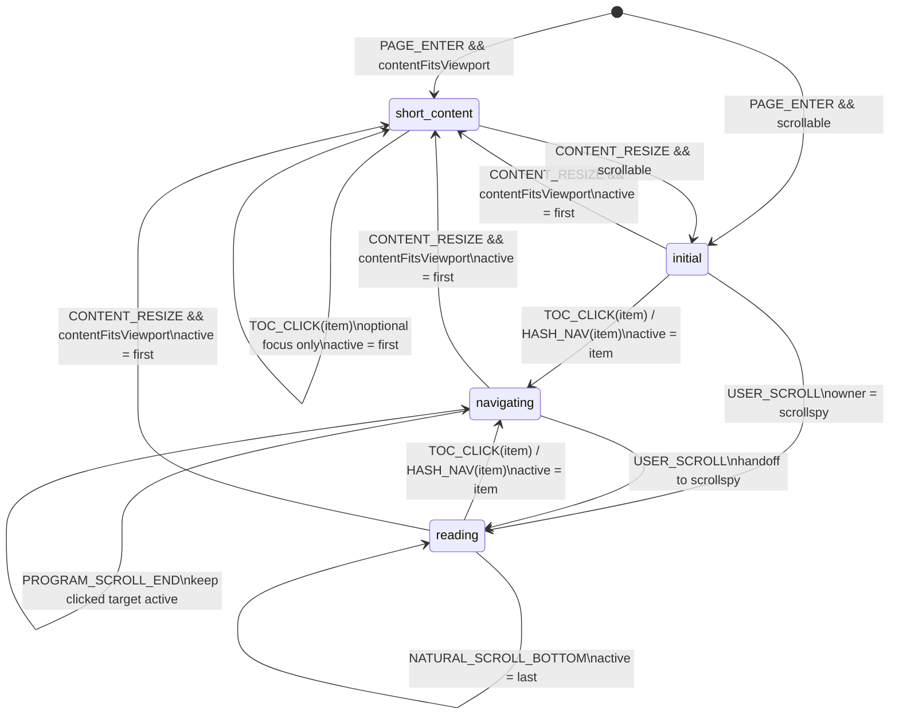

# SysFolio TOC Activation Strategy

## 文档目的

这份文档定义目录高亮（TOC active state）的完整规则，用来解决以下问题：

- 正文已经滚动到底，但 TOC 仍然停留在倒数第二项
- 用户点击倒数第 2 到倒数第 6 项时，高亮被最后一项抢走
- 内容不足一屏时，进入页面高亮直接锁在第二项
- 尾部短章节很多时，TOC 高亮表现和用户感知不一致

当前假设：

- 暂时没有 footer
- 暂时没有评论区
- 暂时没有推荐内容
- TOC 只映射正文主内容结构

在这个前提下，TOC 应表达“当前正文章节”，而不是“整页滚动百分比”。

## 设计目标

1. TOC 高亮应尽量反映“当前阅读章节”。
2. 用户刚进入页面时，高亮应稳定、可预期。
3. 用户点击 TOC 时，被点击项不能表现成“点了没用”。
4. 用户自然滚到底时，不应出现“目录还没到最后”的违和感。
5. 规则应同时适用于长章节、短章节、尾部短章节簇和不足一屏的内容。

## 结论

推荐采用完整状态规则，而不是只靠单一 scrollspy：

`初始态 -> 导航态 -> 阅读态 -> 到底兜底`

并配合两个辅助策略：

`激活线 + 正文底部留白`

最终优先级为：

`初始态 / 短内容态 > 点击导航态 > 阅读态 > 到底兜底`

更准确地说：

`TOC active 不是纯 scrollspy，而是一个由轻量状态机调度的 scrollspy`

## 状态机概览

### 1. 设计判断

如果不引入状态机，以下规则会互相抢占：

- 初始进入页面
- 内容不足一屏
- 用户点击 TOC
- 程序滚动中
- 用户手动滚动
- 已自然滚动到底

结果就是：

- 首屏高亮被第二项抢走
- 点击倒数第 2 到倒数第 6 项时，被最后一项抢高亮
- 到底兜底在错误时机触发

因此，这里不应该只写一组 if-else，而应该明确一套轻量状态机。

### 2. 状态列表

- `initial`
  页面刚进入，还没有主动滚动，也没有显式导航
- `short_content`
  正文没有真实滚动空间
- `navigating`
  用户点击 TOC 或 hash 导航后，程序正在定位目标章节
- `reading`
  用户主动滚动正文，scrollspy 正常接管

说明：

- `bottom_reached` 不必强制建成独立常驻状态
- 更适合作为 `reading` 状态下的一个高优先级条件

### 3. 事件列表

- `PAGE_ENTER`
  页面首次进入
- `CONTENT_FITS_VIEWPORT`
  正文高度不足以形成真实滚动
- `TOC_CLICK(item)`
  用户点击某个 TOC 项
- `HASH_NAV(item)`
  通过 hash 或程序路由定位某一节
- `PROGRAM_SCROLL_START`
  开始程序滚动
- `PROGRAM_SCROLL_END`
  程序滚动结束
- `USER_SCROLL`
  用户主动滚动正文
- `NATURAL_SCROLL_BOTTOM`
  用户在阅读态下自然滚动到底
- `CONTENT_RESIZE`
  内容高度或视口高度发生变化，需要重新判断是否属于短内容态

### 4. Active Owner

状态机里最好明确“当前谁在控制 active item”，否则实现时还是会抢优先级。

推荐规则：

- `initial` / `short_content`
  owner 是 `default`
- `navigating`
  owner 是 `clicked target`
- `reading`
  owner 是 `scrollspy`
- `reading + natural bottom`
  owner 仍然是 `scrollspy`，但进入最后一项兜底分支

一句话：

- 默认由页面入口决定
- 点击后由点击目标决定
- 主动滚动后再交给 scrollspy

### 5. 状态转移

推荐按以下方式理解：

- `PAGE_ENTER`
  - 如果正文不足一屏：进入 `short_content`
  - 否则：进入 `initial`

- `TOC_CLICK(item)` / `HASH_NAV(item)`
  - 从任意可导航状态进入 `navigating`
  - 立即把 active item 设为目标项

- `PROGRAM_SCROLL_END`
  - 仍停留在 `navigating`
  - 直到出现 `USER_SCROLL` 才交给 `reading`

- `USER_SCROLL`
  - 从 `initial` 或 `navigating` 进入 `reading`
  - 开始按激活线更新 active item

- `NATURAL_SCROLL_BOTTOM`
  - 仅在 `reading` 中生效
  - 激活最后一项

- `CONTENT_RESIZE`
  - 重新判断是否应切换到 `short_content`

### 6. 状态转移表

| 当前状态 | 事件 / 条件 | 下一状态 | Active Owner | 关键动作 |
| --- | --- | --- | --- | --- |
| `[entry]` | `PAGE_ENTER` 且内容不足一屏 | `short_content` | `default` | 高亮第一个 TOC 项 |
| `[entry]` | `PAGE_ENTER` 且正文可滚动 | `initial` | `default` | 高亮第一个 TOC 项 |
| `initial` | `TOC_CLICK(item)` / `HASH_NAV(item)` | `navigating` | `clicked target` | 立即高亮目标项，启动程序滚动 |
| `initial` | `USER_SCROLL` | `reading` | `scrollspy` | 启用激活线判定 |
| `initial` | `CONTENT_RESIZE` 且内容不足一屏 | `short_content` | `default` | 恢复第一个 TOC 项 |
| `short_content` | `CONTENT_RESIZE` 且正文可滚动 | `initial` | `default` | 保持第一个 TOC 项，等待后续交互 |
| `short_content` | `TOC_CLICK(item)` | `short_content` | `default` | 可选地聚焦目标标题，但不把 active owner 交给 scrollspy |
| `navigating` | `PROGRAM_SCROLL_START` | `navigating` | `clicked target` | 保持目标项高亮，暂停到底兜底 |
| `navigating` | `PROGRAM_SCROLL_END` | `navigating` | `clicked target` | 继续保持目标项高亮 |
| `navigating` | `USER_SCROLL` | `reading` | `scrollspy` | 将控制权交给阅读态 |
| `navigating` | `CONTENT_RESIZE` 且内容不足一屏 | `short_content` | `default` | 退出程序导航，恢复短内容规则 |
| `reading` | `USER_SCROLL` | `reading` | `scrollspy` | 按激活线更新当前项 |
| `reading` | `NATURAL_SCROLL_BOTTOM` | `reading` | `scrollspy` | 激活最后一个 TOC 项 |
| `reading` | `TOC_CLICK(item)` / `HASH_NAV(item)` | `navigating` | `clicked target` | 立即高亮目标项，退出阅读态 |
| `reading` | `CONTENT_RESIZE` 且内容不足一屏 | `short_content` | `default` | 短路 scrollspy，恢复第一个 TOC 项 |

补充说明：

- `NATURAL_SCROLL_BOTTOM` 不是独立常驻状态，而是 `reading` 下的高优先级条件分支。
- `PROGRAM_SCROLL_END` 后仍保持 `navigating`，是为了避免程序滚动刚结束就被激活线或到底兜底抢走高亮。
- `short_content` 中允许点击 TOC 聚焦内容，但默认不把高亮控制权交给被点击项。

### 7. Mermaid 图

### 8. 实现原则

这个状态机不需要复杂框架，但实现上必须满足：

1. 状态决定“当前由谁控制 active item”
2. 激活线只在 `reading` 中使用
3. 到底兜底只在 `reading` 中使用
4. `navigating` 期间暂停到底兜底
5. `short_content` 直接短路掉 scrollspy

## 一、状态定义

### 1. 初始态

触发条件：

- 用户刚进入页面
- 还没有主动滚动
- 也没有 TOC 点击或显式 hash 导航

规则：

- 默认高亮第一个 TOC 项
- 不立即启动“到底兜底”
- 不让第二个标题因为刚好接近激活线而抢走高亮

设计原因：

- 用户主观上仍处于“文档开头”
- 首屏稳定感优先于机械的几何判定

### 2. 短内容态

触发条件：

- 正文高度小于或接近正文视口高度
- 页面没有真实滚动空间

规则：

- 固定高亮第一个 TOC 项
- 不启用到底兜底
- 不让第二个标题因为初始布局位置而成为当前项

设计原因：

- 这类页面没有真实阅读滚动过程
- 用户进入时更接近“看到整篇的开头”，而不是“当前在第二节”

### 3. 点击导航态

触发条件：

- 用户点击 TOC 项
- 或通过显式 hash / 程序导航定位到某一节

规则：

- 被点击项立即高亮
- 程序滚动期间暂停“到底=最后一项”的兜底逻辑
- 程序滚动结束后，仍保持被点击项为当前项
- 直到用户再次主动滚动，才把控制权交回阅读态

设计原因：

- 用户点击某项时，系统应优先确认“我已响应你的导航”
- 否则尾部短章节会表现成“点了倒数第二项，却亮最后一项”

### 4. 阅读态

触发条件：

- 用户开始主动滚动正文

规则：

- 按激活线判断当前章节
- 当前项为“最靠近且已经进入激活线的标题”
- 倒数第二项会一直保持，直到：
  - 最后一节标题进入激活线
  - 或用户自然滚动到底

设计原因：

- 阅读态要表达“当前正在读哪一节”
- 不应被点击导航态或初始态干扰

### 5. 到底兜底

触发条件：

- 仅在阅读态下
- 且正文容器自然滚动到底

规则：

- 当 `scrollTop + clientHeight >= scrollHeight - epsilon`
- 直接激活最后一个 TOC 项

限制：

- 不用于初始态
- 不用于短内容态
- 不用于点击导航态的程序滚动过程

设计原因：

- 它只用于满足“已经读完正文”的用户预期
- 不应抢占点击导航和初始定位的优先级

## 二、主规则：激活线

阅读态下，TOC 当前项不建议按“标题碰到视口顶边”来判断，而建议按“标题进入激活线”来判断。

建议规则：

- 在正文滚动容器内设置一条激活线
- 激活线位置建议在视口顶部下方约 `25%~33%`
- 当某个标题进入或越过这条线时，将对应 TOC 项设为当前项

设计原因：

- 比顶边判断更符合人的阅读感知
- 章节切换不会太晚
- 对长文阅读更自然

## 三、正文底部留白

正文末尾应保留一段底部留白，让最后一个章节在视觉上有机会真正进入阅读区，而不是贴着页面底边结束。

建议方向：

- 在正文内容区增加适度 bottom padding
- 目的不是制造空白，而是给最后几节留下进入激活线的空间

设计原因：

- 可以减少尾部短章节的判定问题
- 让阅读结束时的视觉节奏更从容
- 能降低对“到底兜底”的依赖

## 四、规则优先级

TOC 高亮必须按以下优先级执行：

1. `短内容态`
2. `初始态`
3. `点击导航态`
4. `阅读态`
5. `到底兜底`

可简化理解为：

`click active > scroll active > bottom fallback`

但在完整实现里，还必须把 `初始态` 和 `短内容态` 放在更前面。

## 五、针对当前异常的处理结论

### 1. 滚到底但还停在倒数第二项

结论：

- 不合理
- 应由“到底兜底”切到最后一项

### 2. 点击倒数第 2 到倒数第 6 项，却高亮最后一个

结论：

- 不合理
- 应由点击导航态优先，先高亮被点击项
- 程序滚动期间不能让到底兜底抢占

### 3. 内容不足一屏，进入页面高亮锁在第二项

结论：

- 不合理
- 应进入短内容态，固定高亮第一个 TOC 项

### 4. 倒数第二项到倒数第六项在自然滚动中很难稳定亮到

结论：

- 可以接受一部分“尾部超短章节在自然滚动中停留时间很短”
- 但不能接受“点击这些项无效”
- 也不能接受“用户读完后仍不是最后一项”

## 六、为什么不用其他方案

### 1. 不推荐只用“标题到顶才激活”

问题：

- 最后一节如果很短，经常永远激活不到
- 章节切换整体偏晚

### 2. 不推荐只用“滚动百分比”

问题：

- 百分比表达的是阅读进度，不是当前章节
- 尾部短章节很多时会失真

### 3. 不推荐只用“到底时切最后一个”

问题：

- 中间过程没有改善
- 点击导航态会被抢占

### 4. 不推荐进入页面立即按激活线判定

问题：

- 不足一屏内容会直接高亮第二项
- 首屏稳定感差

## 七、适用于当前 SysFolio 的规则

在当前没有 footer、评论区、推荐内容的前提下，TOC 高亮建议按以下顺序工作：

1. 如果正文没有真实滚动空间，固定高亮第一个 TOC 项
2. 如果用户刚进入页面且还没主动滚动，默认高亮第一个 TOC 项
3. 如果用户点击了 TOC 项，立即高亮目标项，并在程序滚动期间暂停到底兜底
4. 如果用户开始主动滚动，再按激活线判断当前章节
5. 如果用户在阅读态下自然滚动到底，激活最后一个 TOC 项
6. 正文末尾保留额外底部留白，帮助最后几节自然进入激活区

## 八、交互解释

这套规则表达的是：

- TOC 代表“当前正文章节”
- 不是“整个页面滚动位置”
- 也不是“纯阅读进度条”

因此：

- 进入页面时，系统先承认“你在文档开头”
- 点击某项时，系统先承认“你要去这一节”
- 阅读滚动时，系统再判断“你现在正在看哪一节”
- 只有读到正文底部时，系统才承认“你已经到最后一节”

## 九、给前端的实现约束

1. 以正文滚动容器为判断基准，不以整页文档高度为准。
2. 激活线只在阅读态中启用，不要在初始态直接抢占高亮。
3. 到底兜底必须保留，但只能用于阅读态。
4. 程序滚动期间暂停到底兜底，不让最后一项抢走点击目标。
5. 底部留白应放在正文内容区，不建议用页面外层 hack。
6. 若后续加入 footer、评论区或推荐内容，需要重新定义“TOC 映射正文结束”还是“映射整页结束”。

## 十、当前设计判断

对于当前 SysFolio，这不是一个“视觉特效”问题，而是阅读定位状态机问题。  
最合适的处理方式是：

`短内容态 / 初始态 / 点击导航态 / 阅读态 / 到底兜底`

并辅以：

`激活线 + 正文底部留白`

这也是当前最推荐给前端实现的完整方案。
